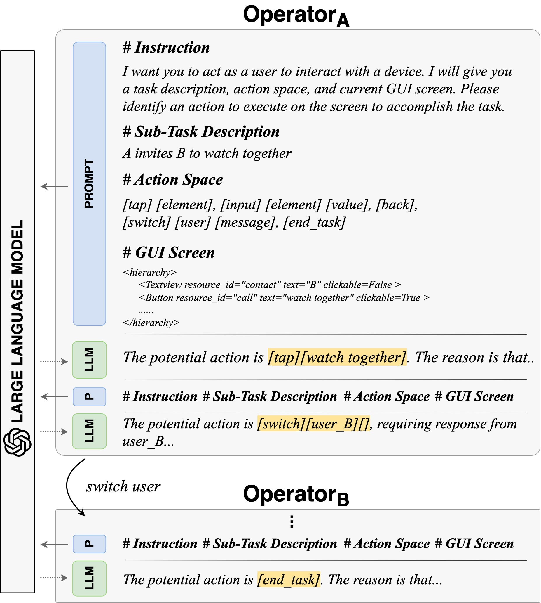
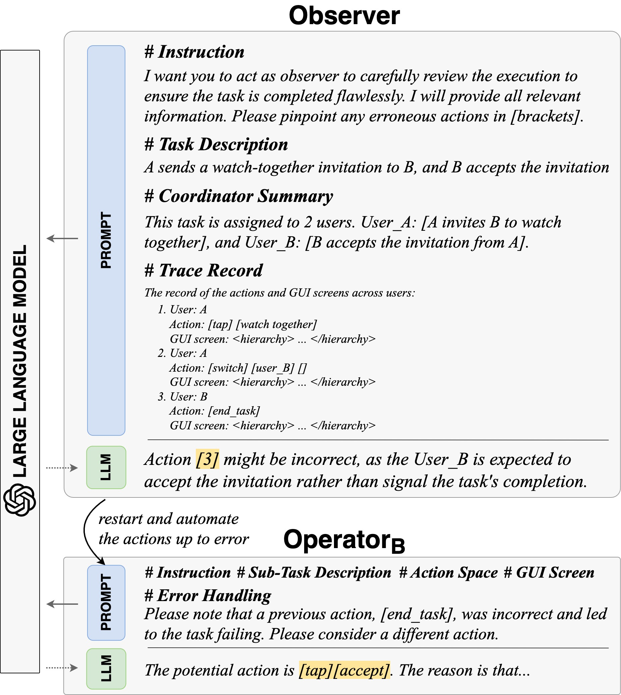

# Breaking Single-Tester Limits: Multi-Agent LLMs for Multi-User Feature Testing

## Table of Contents
- [Table of Contents](#table-of-contents)
- [Getting Started](#getting-started)
- [Definition of Multi-User Interactive Feature](#definition-of-multi-user-interactive-feature)
- [Approach](#approach)
    - [Coordinator](#coordinator)
    - [Operator](#operator)
    - [Observer](#observer)
- [Evaluation](#evaluation)
    - [RQ1: Performance of MADROID](#rq1-performance-of-madroid)
    - [RQ2: Comparison with State-of-the-Art](#rq2-comparison-with-state-of-the-art)
    - [RQ3: Usefulness of MADROID](#rq3-usefulness-of-madroid)

## Getting Started

 

Figure: Illustration of a group voice call.

The growing dependence on mobile phones and their apps has made multi-user interactive features—like chat calls, live streaming, and video conferencing—indispensable for bridging the gaps in social connectivity caused by physical and situational barriers. However, automating these interactive features for testing is fraught with challenges, owing to their inherent need for timely, dynamic, and collaborative user interactions, which current automated testing methods inadequately address. 

Inspired by the concept of agents designed to autonomously and collaboratively tackle problems, we propose MAdroid, a novel multi-agent approach powered by the Large Language Models (LLMs) to automate the multi-user interactive task for app feature testing. Specifically, MAdroid employs two functional types of multi-agents: user agents (Operator) and supervisor agents (Coordinator and Observer). Each agent takes a specific role: the Coordinator directs the interactive task; the Operator mimics user interactions on the device; and the Observer monitors and reviews the task automation process. 

## Definition of Multi-User Interactive Feature

Unlike the general features, the app’s multi-user interactive feature encompasses collaborative interactions that are responsive to inputs from multiple users. In this section, we first define the problem of multi-user interactive features. Then, we briefly discuss the concept of multi-agent that we adopt in the design of our approach.

 

Figure: Multi-user interaction.

The definition of multi-user interactive features is dissected into three fundamental elements.

The feature enables user-to-user communication through the software. It can be a two-way or multiway interaction between end-users. Note that interactions between a user and the software or the administrator are not categorized under multi-user interactive features.

A critical aspect of the interactive feature is its fundamental interactivity. This characteristic is marked by the presence of interactive cues including notifications or pop-up messages, that differ significantly from collaborative features like text editing. These cues play a crucial role in ensuring users are aware of others’ requests and encouraging them to act or respond.

The interactive feature pertains to a timely nature. Interactions should occur with minimal delay, though not necessarily instantaneously, to maintain a fluid information exchange and keep users actively engaged.

## Approach

 

Figure: The overview of MADROID.

MADROID is designed with a multi-agent-based architecture, including user-oriented multi-agents (Operator) and supervisor-oriented agents (Coordinator and Observer). 
User agents are designed to mimic end-users, simulating multi-user interactions within the app environment, while supervisor agents with distinct roles aim to oversee the execution of tasks.
In detail, the Coordinator directs the task; the Operator emulates the actions of interactive users; and the Observer reviews the task automation process.

> For more approach details and implementations, please check the instructions in [README.md](./approach)

### Coordinator

 

Figure: The example of prompting Coordinator.

The initial stage of our approach is utilize the Large Language Models (LLMs) to understand, analyze, organize, and strategize for prospective events derived from a high-level task description.
The *Coordinator* agent assumes the role of autonomous planner, which involves figuring out the number of required devices, partitioning the task into each device, and determining the task order.

### Operator

 

Figure: The example of prompting Operator.

Once the task coordination has been determined, we proceed by selecting the devices from the device farm, assigning them their sub-tasks, and establishing their initiation sequence. Subsequently, we deploy an individual *Operator* agent onto each device to navigate the GUI screen and fulfill the designated task.

### Observer

 

Figure: The example of prompting Observer.

Integrating LLMs for achieving interactive actions does not guarantee flawless inference of the desired outcomes. To mitigate these issues, similar to how professional developers carry out code reviews, we introduce an additional LLM agent acting as an external observer. This *Observer* agent periodically provides feedback based on a higher level of information.

## Evaluation

We describe the procedure we used to evaluate MADROID in terms of its performance.

- **RQ1:** How effective is our approach in automating multi-user interactive feature tasks?
- **RQ2:** How does our approach compare to the state-of-the-art methods?
- **RQ3:** How useful is our approach in real-world multi- user interactive feature testing?

For RQ1, we present the general performance of our approach in automating multi-user interactive tasks.
Moreover, we assess the impact of individual components within our approach by conducting an ablation study. 
For RQ2, we carry out experiments to check the effectiveness of our approach against three state-of-the-art baselines. 
For RQ3, we evaluate the usefulness of our approach to detect interactive bugs within real-world development environments.

### RQ1: Performance of MADROID

Table: Detailed results for the multi-user interactive tasks, and the actions are displayed in a format of #successfullyexecuted/#ground-truth.

Our approach achieves an average action similarity of 96.8%, successfully completing 82.9% of multi-user interactive tasks, which significantly surpasses the results of the ablation baselines. Operator only, achieves the worst performance, i.e., 46.3% success rate and 79.1% action similarity. 

The Coordinator agent (Operator+Coordinator) enhances the success rate of task automation by 9.8%, i.e., 56.1% vs 46.3% compared to Operator only. Furthermore, the Observer agent (Operator+Observer) demonstrates improvements of 12.4% in action similarity accuracy and 19.5% in success rate, compared with Operator only.

### RQ2: Comparison with State-of-the-Art

Table: Performance comparison of state-of-the-art.

Our approach outperforms the others across all evaluated metrics, achieving an average increase of 14.6% in success rate and 7.2% in action similarity over the best baseline, Mobile-agent.
Mobile-agent is hindered by all of the same constraints for the MAdroid and its ablation baselines.
Additionally, it is prone to making incorrect LLM inferences about the actions to be performed on the screen. This discrepancy may stem from the fact that Mobile-agent’s goals are slightly different from ours, being predominantly geared toward single-user scenarios than covering specific multi-user interactive features.

Our observations indicate that Monkey, Sapienz, Stoat, and Humanoid manage to successfully complete 7.3%, 9.6%, 12.2%, and 9.6% of the multi-user interactive tasks, respectively. This indicates that random exploration can incidentally test some level of multi-user interactive features. However, this approach falls short for more complex multi-user interactive tasks.

### RQ3: Usefulness of MADROID

Table: Confirmed or fixed bugs.

&nbsp;
&nbsp;

Figure: Illustration of interactive bug from linphone-android app. 

Our MADROID successfully completes 88.3% of the 111 instances of task automation for regression testing. Of the instances that failed, 11 (84.6%) of these are manually identified as bugs. To further validate the effectiveness of the bugs, we cross-reference them with related issues reported in their issue-tracking repositories on GitHub, where 7 bugs have been confirmed/fixed. 
For the remaining 4 bugs, which have not been reported earlier, we submit new issue reports under review, and as of now, none have been dismissed.

Upon further examination of the bugs, we discover that all of them require multi-user interaction to be triggered. However, the testing capabilities of multi-user interactive features are not found in the existing automated tools, indicating the usefulness of our approach.
