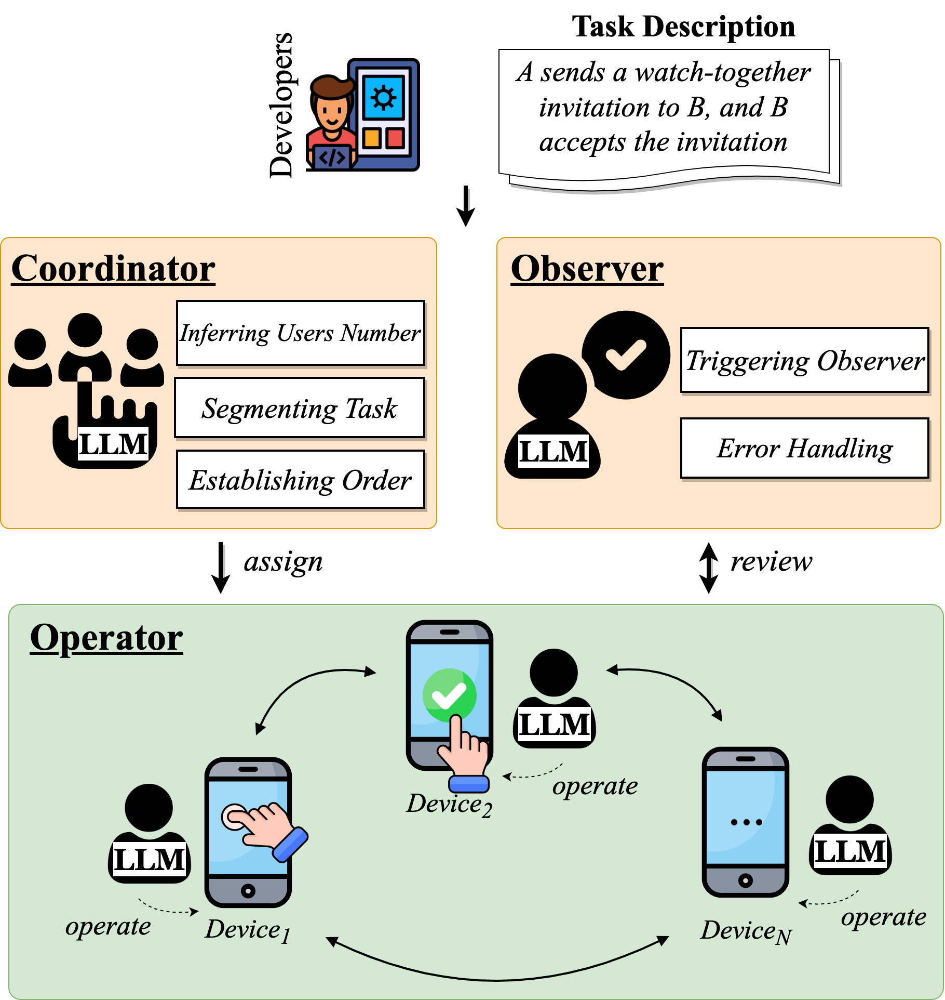
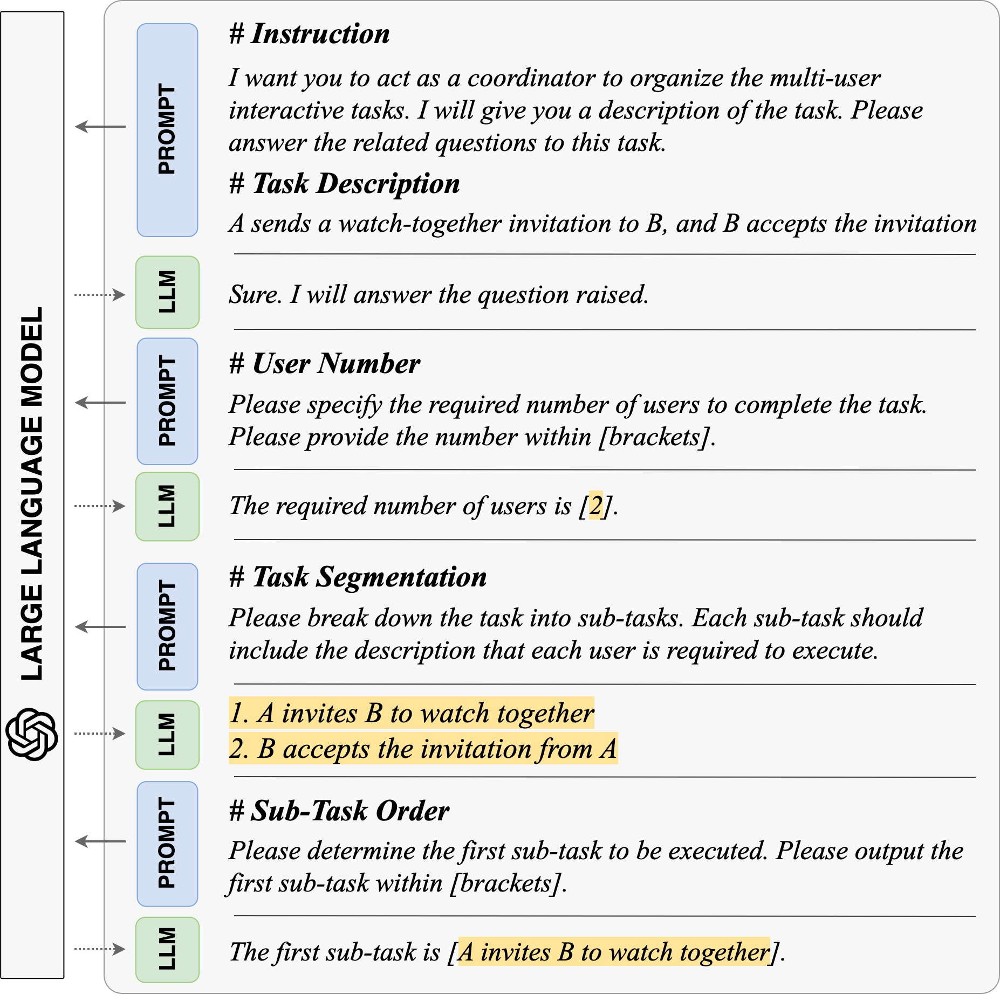
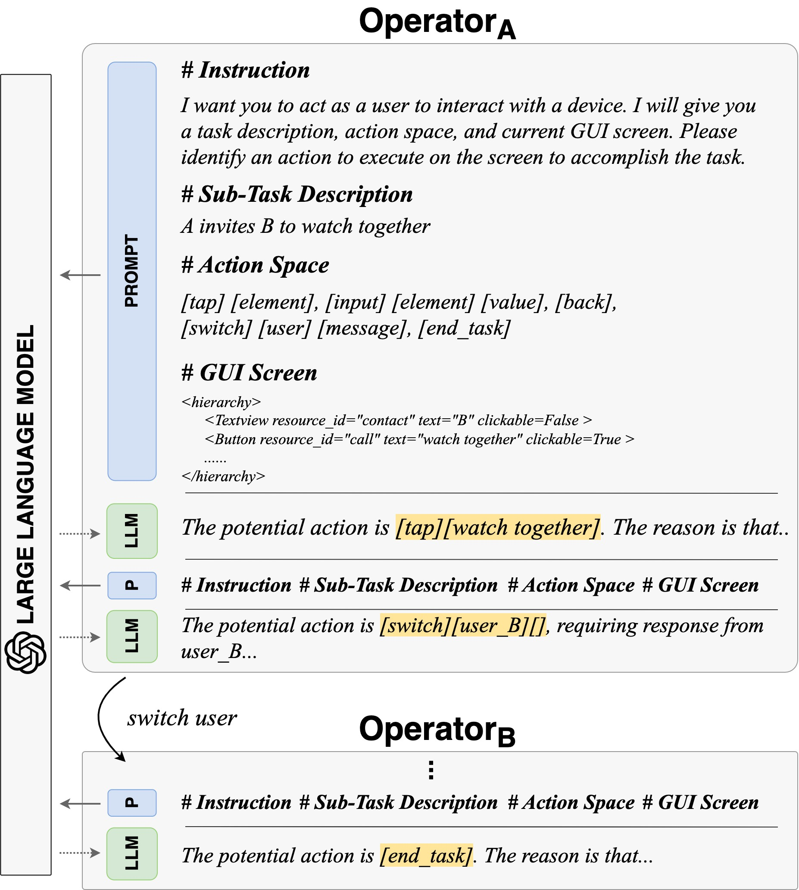
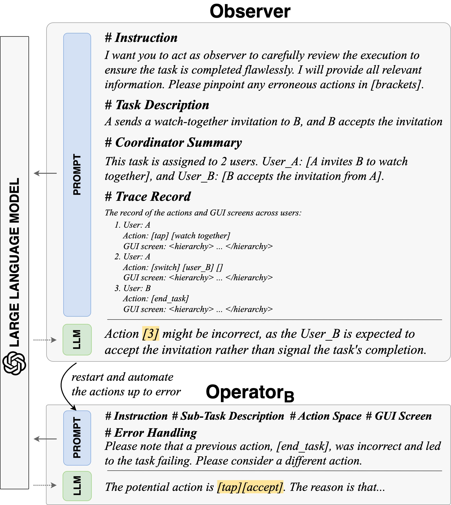

# Approach
<p align="center">
 
</p>
<p align="center">Figure: The overview of MADROID.</p>

## Overview

MADROID is designed with a dual multi-agent-based architecture, including task-oriented multi-agents (Operator) and methodology-oriented agents (Coordinator and Observer). This structure mirrors the analogous human roles typically involved in multi-user interactive feature testing: the task director, the interacting users, and the task reviewer, respectively. Each agent embodies a specific objective of the process, paralleling the collaborative efforts of a human team in ensuring communication.
More specifically, given a natural language task description, the Coordinator is responsible for planning the task, the Operator interacts on devices, and the Observer reviews the task progress.

## Fully Automation of MADroid

### Prerequisites
- Python 3.6.9 installed
  - Other versions are not verified.
  - If none installed yet, can use Anaconda/Miniconda as mentioned below
### Installing Anaconda/Miniconda
- We will use conda to manage python package dependencies.
- We recommend you install Miniconda from [here](https://docs.conda.io/en/latest/miniconda.html) or Anaconda from [here](https://www.anaconda.com/distribution/).
  - select "Add Anaconda to PATH" option during the install (more than one path variable is needed and this option takes care of them all).
- If freshly downloaded, you have python 3.7 or newer. As mentioned earlier, downgrade to python 3.6.9 using 'conda install python=3.6.9'.
### MADroid Installation
- Ensure that the environment you are running in is operating with Python 3.6.9.
- Current Option:
  - Clone the repository [here](https://github.com/codepusher94/MAdroid.git), navigate to madroid directory, and execute `pip install -r requirements.txt`. Please make sure you have installed all the requirements.
### Android SDK Installation
- **Prerequisites**
  - Operating System: Windows, macOS, or Linux
  - Java Development Kit (JDK): Make sure you have the JDK installed on your machine. You can download it from the Oracle website and follow the installation instructions specific to your operating system.
- **Download the Android SDK**: Visit the official Android Developer website [here](https://developer.android.com/studio/index.html#command-tools) and download the Android SDK command-line tools package suitable for your operating system.
- **Extract the SDK**: Once the download is complete, extract the contents of the downloaded archive to a directory of your choice on your machine. This will be your Android SDK installation directory.
- **Set up Environment Variables**
  - **Windows**: Open the Start menu, right-click on "Computer" or "This PC," and select "Properties." In the System window, click on "Advanced system settings" on the left sidebar. In the System Properties window, click on the "Environment Variables" button. Under "System variables," click "New" and enter the following:
    - Variable name: ANDROID_HOME
    - Variable value: Path to your Android SDK directory (e.g., C:\android-sdk)
    - Click "OK" to save the variable.
    - Locate the "Path" variable under "System variables" and click "Edit." Add the following entry at the end: %ANDROID_HOME%\tools;%ANDROID_HOME%\platform-tools 
    - Click "OK" to save the changes.
  - **macOS / Linux**: Open a terminal and navigate to your home directory (cd ~). Open the .bashrc or .bash_profile file using a text editor (e.g., nano .bashrc). Add the following lines at the end of the file:
  ```
  export ANDROID_HOME=/path/to/your/Android/sdk
  export PATH=$PATH:$ANDROID_HOME/tools:$ANDROID_HOME/platform-tools
  ```
    - Save the file and exit the text editor. Run the command source .bashrc or source .bash_profile to apply the changes.
- **Install SDK Packages**: Open a terminal or command prompt and navigate to your Android SDK installation directory (cd /path/to/your/Android/sdk).
  - **Windows**: Run the following command:
  ```
  sdkmanager.bat --update
  sdkmanager.bat "platform-tools" "platforms;android-30" "build-tools;30.0.3"
  ```
  - **macOS / Linux**: Run the following command:
  ```
  ./sdkmanager --update
  ./sdkmanager "platform-tools" "platforms;android-30" "build-tools;30.0.3"
  ```
  - This will download and install the necessary SDK packages, including the platform tools, Android platform, and build tools.
- **Verify Installation**: To verify that the Android SDK installation was successful, open a terminal or command prompt and run the _adb_ (Android Debug Bridge) command. If the installation was successful, you should see the help information and a list of available commands.
### Android Device Connection for ADB
- **Prerequisites**
  - Android device: Ensure that you have several Android devices available.
  - USB cable: Prepare a USB cable to connect your Android device to your computer.
  - USB debugging: Enable USB debugging on your Android device. To do this, go to Settings > Developer options (or Developer settings), and toggle the USB debugging option.
- **Connect the Android Device**: Use a USB cable to connect your Android device to your computer. Ensure that the USB debugging option is enabled on your device.
- **Verify Device Connection**: To verify that your Android device is successfully connected to ADB, open a command prompt (for Windows) or terminal (for macOS and Linux) and run the following command:
  ```
  adb devices
  ```
  - This will display a list of connected devices. If your device is listed along with the "device" status, it means the device is connected and recognized by ADB.

### Fully Automated Execution

1. Make sure you have connected the devices via ADB and installed the necessary Python libraries dependencies.
2. Prepare a GPT API key, and go to approach/utils/base_utils/llm.py, replace the api_key with your own API key.
3. Open the app you want to test and navigate to the social scene interface (ensure that each device has entered the interface).
4. Run the script in [main.py](./main.py)
```

# multi-user interactive task
TASK_DESCRIPTION = "UserA makes a video call to UserB, UserB accepts the call"

# device from the device farm
DEVICE_SERIES-1 = "emulator_5554"
DEVICE_SERIES-2 = "emulator_5555"
DEVICE_SERIES-N = ...

python main.py --task ${TASK_DESCRIPTION} \
               --dip ${DEVICE_SERIES-1} ... ${DEVICE_SERIES-N}
```


## Execution for Single Agent (Debugging Purpose)

### Coordinator

<p align="center">
 
</p>
<p align="center">Figure: The example of prompting Coordinator.</p>

The *Coordinator* agent assumes the role of autonomous planner, which involves figuring out the number of required devices, partitioning the task into each device, and determining the task order. Note that our task planning is executed step by step, aligning with the chain-of-thought paradigm.

Run the script on a natural language task description in [coordinator.py](./coordinator.py)
```

# multi-user interactive task
TASK_DESCRIPTION = "UserA makes a video call to UserB, UserB accepts the call"

python coordinator.py --task ${TASK_DESCRIPTION} 
```


### Operator

<p align="center">
 
</p>
<p align="center">Figure: The example of prompting Operator.</p>

Once the task coordination has been determined, we proceed by selecting the devices from the device farm, assigning them their sub-tasks, and establishing their initiation sequence. Subsequently, we deploy an individual *Operator* agent onto each device to navigate the GUI screen and fulfill the designated task.

Run the script on task coordination in [operator.py](./operator.py)
```

# multi-user interactive task
TASK_DESCRIPTION = "UserA makes a video call to UserB, UserB accepts the call"

# device from the device farm
DEVICE_SERIES-1 = "emulator_5554"
DEVICE_SERIES-2 = "emulator_5555"
DEVICE_SERIES-N = ...

python operator.py --task ${TASK_DESCRIPTION} \
                   --dip ${DEVICE_SERIES-1} ... ${DEVICE_SERIES-N}
```


### Observer

<p align="center">
 
</p>
<p align="center">Figure: The example of prompting Observer.</p>

Similar to how professional developers carry out code reviews, we introduce an additional LLM agent acting as an external observer. This *Observer* agent periodically provides feedback based on a higher level of information.

Run the script in [observer.py](./observer.py)
```

# multi-user interactive task
TASK_DESCRIPTION = "UserA makes a video call to UserB, UserB accepts the call"

# device's total number
DEVICE_NUM = "2"

# device's ID of current device
DEVICE_ID = "1"

# the history record of the task
HISTORY_PATH = "/path/to/history_record"

# the xml file of current screen
XML_PATH = "/path/to/current_screen"

python observer.py --task ${TASK_DESCRIPTION} \
                   --dnum ${DEVICE_NUM} \
                   --deviceid ${CURRENT DEVICE ID} \
                   --historyInof ${HISTORY_PATH} \
                   --currentXml ${XML_PATH}
```

